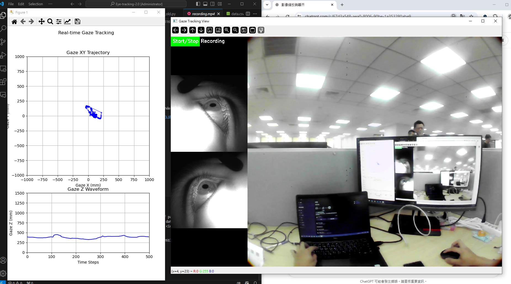

# Gaze Tracking with Sol SDK
### 1. Set Up Environment with Anaconda
To ensure a smooth setup, use Anaconda to create a virtual environment:
```shell
conda create --name gaze_env python=3.8
conda activate gaze_env
```
### 2. Install SDK and Dependencies  
Run the following command:
```shell
pip install .\ganzin_sol_sdk-1.1.1-py3-none-any.whl
```
### 3. Install Additional Packages
After installing the SDK, install the required dependencies:
```shell
pip install requests opencv-python
```
### 4. Configure Server Information
Modify utils/server_info.py to set the correct IP address and port:
```PYTHON
def get_ip_and_port():
    return ('173.20.10.11', '8080')  # Ensure the correct IP address
```
### 4. Run Gaze Streaming
```shell
cd example/synchronous/
python gaze_streaming_xyz_display.py
```
This will start the gaze tracking system and display the real-time gaze coordinates.
### 5. Demo
